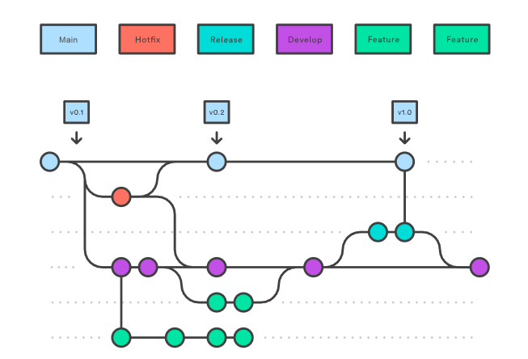

# Doc_GitFlow

# Documentação sobre gestão Git Flow

## Introdução
Na Pernambucanas, adotamos o modelo de gestão **Git Flow**, o que nos permite manter uma maior organização das branches, reduzir possíveis conflitos de código e garantir um fluxo de trabalho mais eficiente.  

Além disso, essa prática promove a aplicação de boas práticas de versionamento, contribuindo para a qualidade e a segurança do desenvolvimento.  

Por isso pedimos para as equipes utilizem essa metodologia de gestão.

---

## O que é Git Flow?

A gestão **Git Flow** é um modelo de organização do versionamento de código baseado em **branching strategy** (estratégia de ramificações).  

Ela define regras e padrões para criação, uso e finalização de branches dentro de um repositório Git.  

A ideia é separar de forma clara:
- o que está em produção,  
- o que está em desenvolvimento,  
- o que são novas funcionalidades,  
- versões de release  
- e correções urgentes.  

---

## 🔹 Benefícios da gestão Git Flow
- **Organização:** cada branch tem uma função específica no ciclo de vida do software.  
- **Colaboração:** times podem trabalhar em paralelo sem sobreposição de código.  
- **Controle de versões:** cada release ou hotfix é registrado de forma rastreável.  
- **Redução de conflitos:** menos chances de problemas ao integrar código.  
- **Boas práticas padronizadas:** todos seguem o mesmo fluxo.  

---

## 🔹 Estrutura básica
- **main** → código de produção.  
- **develop** → código estável em desenvolvimento.  
- **feature/\*** → novas funcionalidades.  
- **release/\*** → preparação de versão.  
- **hotfix/\*** → correções emergenciais.  

---
## 🔹 Padroes de commit

Para manter um registro de histórico e organização, adotamos o padrão convencional de commits 
que é o famoso “Padrão de commits”. Esse padrão utiliza-se um prefixo do tipo de mudança seguindo uma descrição objetiva sobre o que foi feito.

## 🔹Fluxo do gitFlow

## 📚 Referências
As informações extraídas para realizar essa documentação foram:  

- [Atlassian](https://www.atlassian.com/br/git/tutorials/comparing-workflows/gitflow-workflow)  
- [DEV Community](https://dev.to/renatoadorno/padroes-de-commits-commit-patterns-41co)